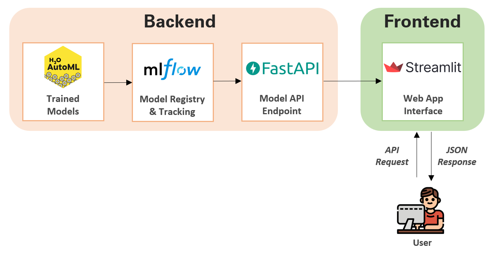
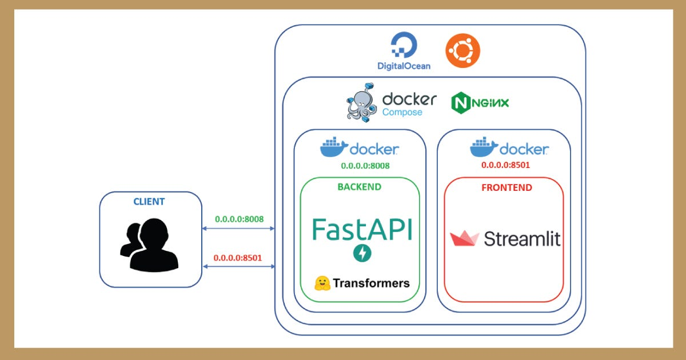

# Model Deployment

## Infrastructure

- **Model Name:** GenPoetry (based on GPT-2)
- **Deployment Platform:** WebApp containerized with Docker and deployed on AWS EC2 (Free Tier)
- **Technical Requirements:** Docker, AWS EC2 access, Linux 22.04
- **Security Requirements:** AWS security policies and configurations
- **Architecture Diagram:**

  
  
  The first diagram illustrates the web application architecture, including all the tools used, such as MLFlow, FastAPI, and model training for the backend, as well as Streamlit for the frontend.
  
  
  
  The second diagram details the web application deployment. The backend and frontend are containerized separately using Docker, and Docker Compose is used to orchestrate their communication and deployment.

## Deployment Code

- **Main File:** Clone the repository into an EC2 instance, navigate to the `GenAI_Poetry/webapp/backend` folder, and execute the following command:
  ```bash
  docker-compose up --build -d
  ```
- **File Access:**
  - **Repository:** [GenAI_Poetry](https://github.com/jgarnicaa/GenAI_Poetry)
  - **S3 Model:** [Download Model](https://genaipoetry-bucket.s3.eu-west-3.amazonaws.com/model/)
  - **DVC Fetch:** [Fetch Data](https://genaipoetry-bucket.s3.eu-west-3.amazonaws.com/files/)
- **Environment Variables:** The model must be downloaded from the provided link and placed in the appropriate directory.

## Deployment Instructions

- **Installation:**
  - Copy the repository into an EC2 instance.
  - Download the model and place it in `webapp/backend/model/`.
  - Navigate to the `webapp/` folder and run:
    ```bash
    docker-compose up --build -d
    ```
- **Configuration Instructions:**
  - The EC2 instance should have at least **12 GB of HDD/SSD storage**.
  - It is recommended to use a **GPU-enabled instance** for faster inference.
- **Usage Instructions:**
  - The EC2 instance has a **public IP**.
  - Open a web browser and go to:
    ```
    http://<EC2_PUBLIC_IP>:8501
    ```
  - You will see the Streamlit app where you can enter a prompt to generate a poem.


